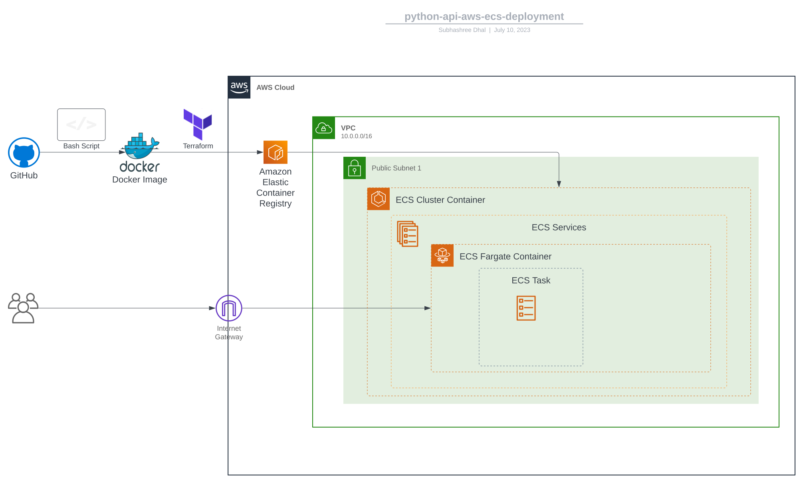

# python-api-infra-deploy
Infrastructure deployment for python-api web application to AWS ECS - https://github.com/mransbro/python-api

## Dependency 
* [AWS CLI - V2](https://aws.amazon.com/cli/)
* [Terraform CLI](https://developer.hashicorp.com/terraform/cli)

<details>
  <summary>Dependency setup on Linux</summary>
```bash
curl "https://awscli.amazonaws.com/awscli-exe-linux-x86_64.zip" -o "awscliv2.zip"
unzip awscliv2.zip
sudo ./aws/install
rm awscliv2.zip
sudo apt-get update && sudo apt-get install -y gnupg software-properties-common
wget -O- https://apt.releases.hashicorp.com/gpg | \
gpg --dearmor | \
sudo tee /usr/share/keyrings/hashicorp-archive-keyring.gpg
gpg --no-default-keyring \
--keyring /usr/share/keyrings/hashicorp-archive-keyring.gpg \
--fingerprint
echo "deb [signed-by=/usr/share/keyrings/hashicorp-archive-keyring.gpg] \
https://apt.releases.hashicorp.com $(lsb_release -cs) main" | \
sudo tee /etc/apt/sources.list.d/hashicorp.list
sudo apt update
sudo apt-get install terraform -y
```
</details>

## Build docker container and push to AWS-ECR

For this following interaction with AWS, make sure the **aws-cli v2** configuration is done for authentication 

Export following ENV - 

```bash
export AWS_ACCESS_KEY_ID=*****************
export AWS_SECRET_ACCESS_KEY=*****************
export AWS_DEFAULT_REGION=*****************
export AWS_ACCOUNT_ID=***************** # to be used in ECR image path
```

Clone the python-api repo to build the docker image

```bash
git clone https://github.com/RuchiDhal/python-api-infra-deploy
cd python-api-infra-deploy
./docker-build-push.sh
```

## Deploy the application to AWS-ECS 

* Replace the 

```bash
terraform init
terraform plan
terraform apply -auto-approve
```


